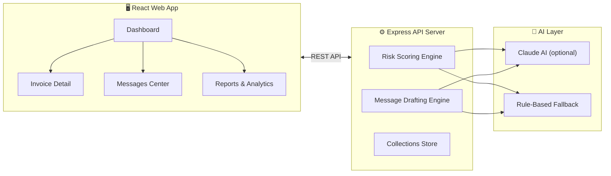

# Collections Copilot — Project Overview

## What Is This Project?

**Collections Copilot** is an **AI-powered debt-collection assistant** for businesses. Think of it as a smart dashboard that helps your accounts team chase overdue invoices — it tells you *who* to follow up with first, *why* they're risky, and even *writes the follow-up email* for you.

In plain English: **if a customer hasn't paid their bill, this tool helps you figure out who to call first and what to say.**

---

## The Problem It Solves

When a company has dozens (or hundreds) of unpaid invoices, the accounts team needs to answer:

1. **Which invoice should I chase first?** — A ₹7,20,000 invoice from a chronic late-payer is more urgent than a ₹6,800 invoice from a brand-new customer who's 2 days late.
2. **How firmly should I write the follow-up?** — A gentle nudge to a long-time partner vs. a final warning to a repeat offender.
3. **What should the email actually say?** — Writing 18 different relationship-aware emails is time-consuming.

Collections Copilot automates all three.

---

## How It Works (The Big Picture)



| Layer | What it does |
|-------|-------------|
| **Frontend** | React app where the user sees the dashboard, reviews invoices, edits drafts, and sends messages |
| **API Server** | Express backend that scores risk, generates follow-up messages, and manages state |
| **AI / Fallback** | Tries Claude AI first for smarter outputs; automatically falls back to deterministic rules if AI is unavailable |

---

## Key Features

### 🎯 Risk-Ranked Dashboard
Every overdue invoice gets a **risk score (0–100)** and a **risk level** (Low / Medium / High / Critical). The dashboard sorts them so the most dangerous invoices appear at the top.

The risk score weighs:
- How many days overdue
- Customer's payment history (chronic late payer vs. always on time)
- Number of reminders already sent
- Invoice size relative to the customer's annual volume
- Length of relationship (long-term clients get a softer treatment)

### ✉️ AI-Drafted Follow-Up Messages
For each invoice, the system generates a follow-up email with the right **tone**:

| Tone | When it's used |
|------|---------------|
| `gentle` | Just overdue — a friendly nudge |
| `firm` | 15+ days overdue — professional but direct |
| `serious` | 31+ days — demands immediate attention |
| `final` | 61+ days — last warning before escalation |

Users can click **"Softer"** or **"Firmer"** to regenerate the message with a different tone.

### 📊 Reports & Analytics
Charts and breakdowns showing total overdue amounts, risk distribution, customer concentration, and trends.

### 🔄 Demo Mode
The app ships with **18 realistic seed invoices** (Indian companies like *Ashoka Steel Traders*, *Meridian Textiles*, *Bluepeak Analytics*, etc.) so you can try it immediately without connecting a real accounting system. A **"Reset Demo"** button restores everything to the original state.

---

## Project Structure

The project is a **pnpm monorepo** (multiple packages in one repo):

```
collection-assistant/
├── artifacts/
│   ├── collections-copilot/    ← 🖥️ React + Vite frontend
│   ├── api-server/             ← ⚙️ Express 5 backend
│   ├── mockup-sandbox/         ← 🎨 Design sandbox
│   └── ref-design/             ← 🧩 Shared UI component library (shadcn/Radix)
│
├── lib/
│   ├── api-spec/               ← 📜 OpenAPI spec (single source of truth)
│   ├── api-client-react/       ← 🔗 Auto-generated React hooks (via Orval)
│   ├── api-zod/                ← ✅ Auto-generated Zod validators
│   └── db/                     ← 🗄️ Drizzle ORM schema (PostgreSQL)
│
├── scripts/                    ← 🛠️ Build & utility scripts
├── docs/                       ← 📄 Planning documents
└── screenshots/                ← 📸 UI screenshots
```

### What Each Package Does

| Package | Path | Purpose |
|---------|------|---------|
| **Collections Copilot** | [`artifacts/collections-copilot/`](file:///Users/akshatnaruka/Desktop/collection-assistant/artifacts/collections-copilot) | The main web app — dashboard, invoice views, message composer, settings |
| **API Server** | [`artifacts/api-server/`](file:///Users/akshatnaruka/Desktop/collection-assistant/artifacts/api-server) | Backend that handles risk scoring, message generation, and state management |
| **Ref Design** | [`artifacts/ref-design/`](file:///Users/akshatnaruka/Desktop/collection-assistant/artifacts/ref-design) | Reusable UI components (buttons, cards, modals, etc.) built with Radix UI + Tailwind |
| **API Spec** | [`lib/api-spec/`](file:///Users/akshatnaruka/Desktop/collection-assistant/lib/api-spec) | The OpenAPI YAML file that defines all API endpoints. Other packages are generated from this |
| **API Client React** | [`lib/api-client-react/`](file:///Users/akshatnaruka/Desktop/collection-assistant/lib/api-client-react) | Auto-generated React Query hooks — call `useGetCollectionsDashboard()` instead of writing fetch calls |
| **API Zod** | [`lib/api-zod/`](file:///Users/akshatnaruka/Desktop/collection-assistant/lib/api-zod) | Auto-generated Zod schemas for request/response validation |
| **DB** | [`lib/db/`](file:///Users/akshatnaruka/Desktop/collection-assistant/lib/db) | Drizzle ORM schema for PostgreSQL (database structure definitions) |

---

## Tech Stack

| Category | Technology |
|----------|-----------|
| **Language** | TypeScript 5.9 (everywhere) |
| **Frontend** | React 19, Vite 7, Tailwind CSS 4, Radix UI, Recharts, Framer Motion |
| **Backend** | Express 5, Node.js 24 |
| **Database** | PostgreSQL + Drizzle ORM |
| **Validation** | Zod (shared between frontend and backend) |
| **API Codegen** | Orval (generates hooks + validators from OpenAPI spec) |
| **Data Fetching** | TanStack React Query |
| **Routing** | Wouter (lightweight client-side router) |
| **AI** | Claude (Anthropic) — with automatic rule-based fallback |
| **Monorepo** | pnpm workspaces |
| **Build** | esbuild (backend), Vite (frontend) |

---

## Frontend Pages

| Page | Route | What it shows |
|------|-------|--------------|
| [Dashboard](file:///Users/akshatnaruka/Desktop/collection-assistant/artifacts/collections-copilot/src/pages/dashboard.tsx) | `/` | Risk metrics, charts, ranked invoice table, search & filters |
| [Invoices](file:///Users/akshatnaruka/Desktop/collection-assistant/artifacts/collections-copilot/src/pages/invoices.tsx) | `/invoices` | Full invoice list with filtering by risk, status, and segment |
| [Invoice Detail](file:///Users/akshatnaruka/Desktop/collection-assistant/artifacts/collections-copilot/src/pages/invoice-detail.tsx) | `/invoices/:id` | Deep-dive into one invoice — risk explanation, editable message composer |
| [Customer Workspace](file:///Users/akshatnaruka/Desktop/collection-assistant/artifacts/collections-copilot/src/pages/customer-workspace.tsx) | `/customers/:id` | Customer profile with all related invoices |
| [Messages](file:///Users/akshatnaruka/Desktop/collection-assistant/artifacts/collections-copilot/src/pages/messages.tsx) | `/messages` | Message history and outbox |
| [Reports](file:///Users/akshatnaruka/Desktop/collection-assistant/artifacts/collections-copilot/src/pages/reports.tsx) | `/reports` | Analytics and reporting dashboards |
| [Risk Models](file:///Users/akshatnaruka/Desktop/collection-assistant/artifacts/collections-copilot/src/pages/risk-models.tsx) | `/risk-models` | Risk model configuration and explanation |
| [Payment Collection](file:///Users/akshatnaruka/Desktop/collection-assistant/artifacts/collections-copilot/src/pages/payment-collection.tsx) | `/payment-collection` | Payment tracking and collection workflows |
| [Integrations](file:///Users/akshatnaruka/Desktop/collection-assistant/artifacts/collections-copilot/src/pages/integrations.tsx) | `/integrations` | External system connections (ERP, accounting, etc.) |
| [Export](file:///Users/akshatnaruka/Desktop/collection-assistant/artifacts/collections-copilot/src/pages/export.tsx) | `/export` | Data export tools |
| [Settings](file:///Users/akshatnaruka/Desktop/collection-assistant/artifacts/collections-copilot/src/pages/settings.tsx) | `/settings` | Company name, currency, escalation thresholds, AI on/off toggle |

---

## API Endpoints

| Method | Endpoint | Purpose |
|--------|----------|---------|
| `GET` | `/collections/dashboard` | Full dashboard with metrics + ranked invoices |
| `GET` | `/collections/invoices/:id` | Single invoice detail with risk + draft |
| `POST` | `/collections/invoices/:id/draft` | Regenerate follow-up message (softer / firmer) |
| `POST` | `/collections/invoices/:id/send` | Mark a message as sent |
| `POST` | `/collections/invoices/bulk` | Bulk regenerate or send for multiple invoices |
| `GET` | `/collections/settings` | Get current settings (company, currency, thresholds) |
| `PATCH` | `/collections/settings` | Update settings |
| `GET` | `/collections/templates` | Get message templates |
| `PATCH` | `/collections/templates` | Update message templates |
| `GET` | `/collections/history` | Get message history |
| `GET` | `/collections/insights` | Get portfolio-level AI insights |
| `POST` | `/collections/reset` | Reset demo to initial state |

---

## How to Run It

```bash
# Install dependencies
pnpm install

# Start the API server (port 5000)
pnpm --filter @workspace/api-server run dev

# Start the frontend (separate terminal)
pnpm --filter @workspace/collections-copilot run dev

# Regenerate API hooks from OpenAPI spec (if you change the spec)
pnpm --filter @workspace/api-spec run codegen

# Run typechecking across all packages
pnpm run typecheck
```

> [!NOTE]
> The app works fully in **offline/fallback mode** with deterministic rule-based scoring. AI features (Claude) are optional and require `AI_INTEGRATIONS_ANTHROPIC_BASE_URL` and `AI_INTEGRATIONS_ANTHROPIC_API_KEY` environment variables.

---

## Architecture Decisions Worth Knowing

| Decision | Why |
|----------|-----|
| **Fixed demo date (2026-09-19)** | So "days overdue" calculations always produce the same results — the demo is stable and reproducible |
| **AI + fallback share the same response contract** | The frontend doesn't care whether the risk score came from AI or rules — it always gets the same JSON shape |
| **In-memory state (no real DB writes for demo)** | Demo mutations are resettable; nothing permanent is modified. The "Reset Demo" button clears everything |
| **OpenAPI as the single source of truth** | API types, React hooks, and Zod validators are all auto-generated from one YAML file. Change the spec → regenerate → everything stays in sync |
| **Supply-chain security** | npm packages must be at least 1 day old before they can be installed (guards against malicious publish attacks) |
