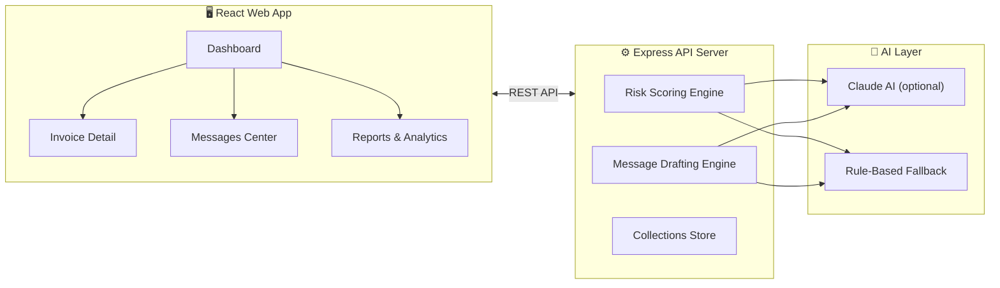

# Collections Copilot

**An AI-powered, full-stack collections workspace that prioritizes overdue invoices by risk, explains why each one matters, and drafts relationship-aware follow-up messages — so your accounts team knows exactly who to chase first and what to say.**

---

## Problem Statement

Accounts receivable teams in mid-size and enterprise businesses routinely manage dozens to hundreds of overdue invoices simultaneously. The core challenge isn't just *knowing* who owes money — it's deciding **who to chase first**, **how firmly to communicate**, and **what to say** without damaging valuable long-term customer relationships.

Traditional approaches are manual and error-prone: finance teams work through spreadsheets sorted by due date, write follow-up emails from scratch, and rely on gut instinct to judge urgency. This leads to:

- **Misallocated effort** — collectors spend equal time on a ₹6,800 invoice from a new client and a ₹7,20,000 invoice from a chronic late-payer
- **Inconsistent tone** — a long-standing enterprise partner gets the same boilerplate as a first-time defaulter
- **Delayed escalation** — critical invoices slip through the cracks until they become write-offs
- **Relationship damage** — overly aggressive messaging alienates otherwise reliable customers

---

## The Solution

Collections Copilot combines a **multi-factor risk scoring engine** with **relationship-aware message generation** to give accounts teams a single, intelligent dashboard where every overdue invoice is ranked by urgency, explained in plain language, and paired with a ready-to-send follow-up message calibrated to the right tone.

### What Makes It Different

1. **Risk isn't just "days overdue"** — The scoring engine weighs six factors: overdue duration, payment history patterns, reminder saturation, invoice-to-annual-volume ratio (financial exposure), relationship tenure, and customer segment. A ₹2,45,000 invoice from a 3-year partner with a perfect track record scores differently than a ₹18,500 invoice from a chronic late-payer — even if both are the same number of days overdue.

2. **AI with a safety net** — The system attempts to use Claude (Anthropic) for nuanced risk reasoning and context-sensitive message drafting. If AI is unavailable, slow, or returns malformed output, it **automatically falls back** to a deterministic rule-based engine that produces identically structured responses. The frontend never knows the difference — both engines share the same validated response contract.

3. **Tone-aware, relationship-preserving communication** — Messages escalate through four calibrated tones (gentle → firm → serious → final notice) based on overdue severity and customer history. Long-term, high-value customers automatically receive softer treatment. Users can manually adjust tone with one click and edit the draft before sending.

4. **Fully interactive demo environment** — The app ships with 18 realistic seed invoices modeled on Indian business scenarios, complete with diverse customer segments (Enterprise, SMB, Startup), varied payment histories, and realistic relationship contexts. A demo reset button restores the original state instantly.

---

## Architecture



### Frontend — React + Vite

A modern single-page application built with **React 19**, **Vite 7**, and **Tailwind CSS 4**. The UI layer uses **Radix UI** primitives for accessible, composable components and **Recharts** for data visualization (risk distribution charts, overdue amount breakdowns). Client-side routing is handled by **Wouter** (a lightweight 2KB alternative to React Router), and server state is managed via **TanStack React Query** with auto-generated hooks.

The frontend includes **11 distinct pages**: a risk-ranked dashboard with real-time search and multi-axis filtering (risk level, status, segment), deep-dive invoice detail views with inline message composers, a messages center with full send history, analytics reports, risk model configuration, payment collection workflows, integration management, data export, and application settings.

### Backend — Express 5 + Node.js 24

A lightweight **Express 5** API server that handles risk scoring, message generation, settings management, and demo state. The server uses **Pino** for structured JSON logging and **esbuild** for fast production bundling.

The collections engine implements:
- A **weighted risk scoring algorithm** that produces a 0–100 score and a four-tier classification (Low / Medium / High / Critical) with human-readable reasoning
- A **template-based message generator** with Mustache-style interpolation, configurable escalation thresholds, and relationship-aware tone softening
- An **AI integration layer** that calls Claude's Messages API with strict output parsing and graceful degradation

### API Contract — OpenAPI + Codegen

The entire API surface is defined in a single **OpenAPI 3.1 specification** file. From this source of truth, **Orval** generates:
- **React Query hooks** (`useGetCollectionsDashboard`, `useGetCollectionInvoice`, etc.) — so the frontend never writes manual fetch calls
- **Zod schemas** — so both the frontend and backend validate the same types at runtime

This eliminates an entire category of bugs: if the API shape changes, the spec is updated once, codegen runs, and TypeScript catches every consumer that needs updating.

### Database — PostgreSQL + Drizzle ORM

The data layer uses **Drizzle ORM** for type-safe schema definitions and migrations against **PostgreSQL**. In demo mode, the app uses an in-memory store overlay on top of seed data — no database connection is required to run the demo.

### Security

The monorepo enforces a **minimum release age policy** (1440 minutes / 24 hours) on all npm dependencies via pnpm configuration — a supply-chain attack defense ensuring most malicious npm packages are discovered and pulled before they can be installed.

---

## Feature Highlights

- **Risk-ranked dashboard** with aggregate metrics (total overdue, critical count, amount requiring action) and interactive charts
- **Multi-axis filtering** — filter invoices by risk level, payment status, customer segment, and free-text search simultaneously
- **Explainable risk scores** — every risk assessment includes a plain-English reasoning paragraph citing specific factors
- **One-click tone adjustment** — regenerate any follow-up message as softer or firmer with a single click
- **Editable message composer** — review, edit, and approve AI-drafted messages before sending
- **Bulk actions** — regenerate or send messages for multiple invoices at once
- **Message history** — full audit trail of every generated and sent message with timestamps and tone metadata
- **Configurable escalation thresholds** — customize the day boundaries for gentle/firm/serious/final tone escalation
- **Customizable message templates** — edit the base templates for each tone level with Mustache-style variables
- **Company branding** — configure company name, currency, and locale for personalized communications
- **AI toggle** — switch between AI and offline mode from settings, with real-time indicator showing the active engine
- **Demo reset** — one-click restoration of all 18 invoices and settings to their original state

---

## Risk Scoring Engine

Every overdue invoice gets a **risk score (0–100)** and a **risk level** (Low / Medium / High / Critical). The dashboard sorts them so the most dangerous invoices appear at the top.

The risk score weighs:
- How many days overdue
- Customer's payment history (chronic late payer vs. always on time)
- Number of reminders already sent
- Invoice size relative to the customer's annual volume
- Length of relationship (long-term clients get a softer treatment)

## Message Drafting Engine

For each invoice, the system generates a follow-up email with the right **tone**:

| Tone | When it's used |
|------|---------------|
| `gentle` | Just overdue — a friendly nudge |
| `firm` | 15+ days overdue — professional but direct |
| `serious` | 31+ days — demands immediate attention |
| `final` | 61+ days — last warning before escalation |

Users can click **"Softer"** or **"Firmer"** to regenerate the message with a different tone.

---

## Project Structure

The project is a **pnpm monorepo** (multiple packages in one repo):

```
collection-assistant/
├── artifacts/
│   ├── collections-copilot/    ← 🖥️ React + Vite frontend
│   ├── api-server/             ← ⚙️ Express 5 backend
│   ├── mockup-sandbox/         ← 🎨 Design sandbox
│   └── ref-design/             ← 🧩 Shared UI component library (shadcn/Radix)
│
├── lib/
│   ├── api-spec/               ← 📜 OpenAPI spec (single source of truth)
│   ├── api-client-react/       ← 🔗 Auto-generated React hooks (via Orval)
│   ├── api-zod/                ← ✅ Auto-generated Zod validators
│   └── db/                     ← 🗄️ Drizzle ORM schema (PostgreSQL)
│
├── scripts/                    ← 🛠️ Build & utility scripts
├── docs/                       ← 📄 Planning documents
└── screenshots/                ← 📸 UI screenshots
```

### What Each Package Does

| Package | Path | Purpose |
|---------|------|---------|
| **Collections Copilot** | `artifacts/collections-copilot/` | The main web app — dashboard, invoice views, message composer, settings |
| **API Server** | `artifacts/api-server/` | Backend that handles risk scoring, message generation, and state management |
| **Ref Design** | `artifacts/ref-design/` | Reusable UI components (buttons, cards, modals, etc.) built with Radix UI + Tailwind |
| **API Spec** | `lib/api-spec/` | The OpenAPI YAML file that defines all API endpoints. Other packages are generated from this |
| **API Client React** | `lib/api-client-react/` | Auto-generated React Query hooks — call `useGetCollectionsDashboard()` instead of writing fetch calls |
| **API Zod** | `lib/api-zod/` | Auto-generated Zod schemas for request/response validation |
| **DB** | `lib/db/` | Drizzle ORM schema for PostgreSQL (database structure definitions) |

---

## Tech Stack

| Category | Technology |
|----------|-----------|
| **Language** | TypeScript 5.9 (everywhere) |
| **Frontend** | React 19, Vite 7, Tailwind CSS 4, Radix UI, Recharts, Framer Motion |
| **Backend** | Express 5, Node.js 24 |
| **Database** | PostgreSQL + Drizzle ORM |
| **Validation** | Zod (shared between frontend and backend) |
| **API Codegen** | Orval (generates hooks + validators from OpenAPI spec) |
| **Data Fetching** | TanStack React Query |
| **Routing** | Wouter (lightweight client-side router) |
| **AI** | Claude (Anthropic) — with automatic rule-based fallback |
| **Monorepo** | pnpm workspaces |
| **Build** | esbuild (backend), Vite (frontend) |

---

## Frontend Pages

| Page | Route | What it shows |
|------|-------|--------------|
| Dashboard | `/` | Risk metrics, charts, ranked invoice table, search & filters |
| Invoices | `/invoices` | Full invoice list with filtering by risk, status, and segment |
| Invoice Detail | `/invoices/:id` | Deep-dive into one invoice — risk explanation, editable message composer |
| Customer Workspace | `/customers/:id` | Customer profile with all related invoices |
| Messages | `/messages` | Message history and outbox |
| Reports | `/reports` | Analytics and reporting dashboards |
| Risk Models | `/risk-models` | Risk model configuration and explanation |
| Payment Collection | `/payment-collection` | Payment tracking and collection workflows |
| Integrations | `/integrations` | External system connections (ERP, accounting, etc.) |
| Export | `/export` | Data export tools |
| Settings | `/settings` | Company name, currency, escalation thresholds, AI on/off toggle |

---

## API Endpoints

| Method | Endpoint | Purpose |
|--------|----------|---------|
| `GET` | `/collections/dashboard` | Full dashboard with metrics + ranked invoices |
| `GET` | `/collections/invoices/:id` | Single invoice detail with risk + draft |
| `POST` | `/collections/invoices/:id/draft` | Regenerate follow-up message (softer / firmer) |
| `POST` | `/collections/invoices/:id/send` | Mark a message as sent |
| `POST` | `/collections/invoices/bulk` | Bulk regenerate or send for multiple invoices |
| `GET` | `/collections/settings` | Get current settings (company, currency, thresholds) |
| `PATCH` | `/collections/settings` | Update settings |
| `GET` | `/collections/templates` | Get message templates |
| `PATCH` | `/collections/templates` | Update message templates |
| `GET` | `/collections/history` | Get message history |
| `GET` | `/collections/insights` | Get portfolio-level AI insights |
| `POST` | `/collections/reset` | Reset demo to initial state |

---

## How to Run It

```bash
# Install dependencies
pnpm install

# Start the API server (port 5000)
pnpm --filter @workspace/api-server run dev

# Start the frontend (separate terminal)
pnpm --filter @workspace/collections-copilot run dev

# Regenerate API hooks from OpenAPI spec (if you change the spec)
pnpm --filter @workspace/api-spec run codegen

# Run typechecking across all packages
pnpm run typecheck
```

> **Note:** The app works fully in **offline/fallback mode** with deterministic rule-based scoring. AI features (Claude) are optional and require `AI_INTEGRATIONS_ANTHROPIC_BASE_URL` and `AI_INTEGRATIONS_ANTHROPIC_API_KEY` environment variables.

---

## Key Technical Decisions

| Decision | Rationale |
|----------|-----------|
| **Dual-engine architecture (AI + fallback)** | Guarantees the product works reliably regardless of AI availability. Users in air-gapped environments or with strict data policies can run entirely on the rule-based engine with zero degradation in UX |
| **Shared response contracts** | Both AI and fallback engines return identically shaped, Zod-validated JSON. The frontend is engine-agnostic — it never branches on whether the response came from AI or rules |
| **Fixed demo date (2026-09-19)** | All "days overdue" calculations use a pinned date so that demo outputs are perfectly reproducible across time and environments |
| **OpenAPI-first development** | The API spec is written first, then code is generated. This inverts the typical workflow and ensures documentation is always current, types are always synchronized, and API consumers are always correct |
| **In-memory demo state with reset** | Demo mutations (mark-as-sent, regenerate draft, change settings) are stored in-process memory. The reset endpoint clears everything — safe to hand to anyone without risk of permanent data changes |
| **Monorepo with workspace protocol** | Shared packages (API types, Zod schemas, UI components) are consumed via `workspace:*` protocol, ensuring all packages always use the same version of shared code without publish/install cycles |
| **Supply-chain security** | npm packages must be at least 1 day old before they can be installed — guards against malicious publish attacks, which are the #1 vector for npm ecosystem compromises |

---

## Business Impact

Collections Copilot directly addresses measurable business outcomes:

- **Reduces Days Sales Outstanding (DSO)** by ensuring high-risk invoices are actioned first, not by due-date order
- **Preserves customer relationships** through tone-calibrated, relationship-aware messaging that avoids alienating long-term partners
- **Increases collector productivity** by eliminating manual email composition — each follow-up takes seconds instead of minutes
- **Reduces write-off risk** through early identification of critical-risk invoices before they age past recovery thresholds
- **Provides management visibility** with real-time dashboards showing portfolio risk distribution and collection progress
